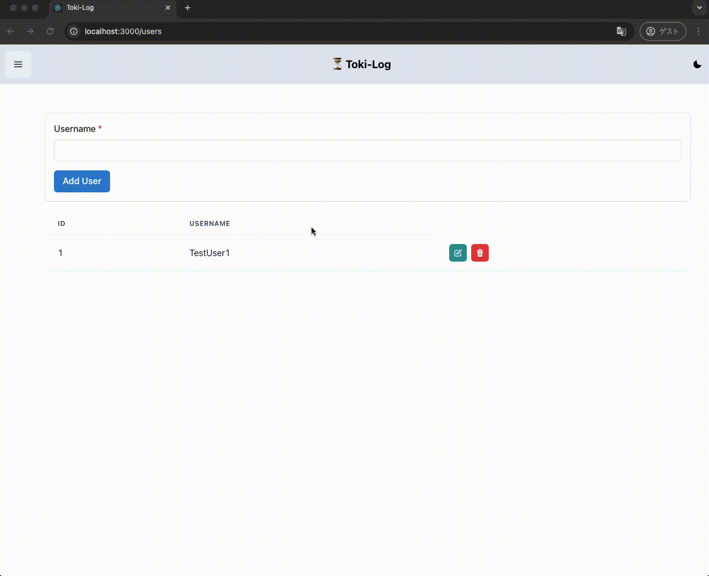

# Toki-Log

作業時間管理アプリ

## What is this?

(エレベーターピッチ)

- `自分のやっている作業の時間の計測・管理` がしたい
- `デスクワーカー` 向けの、
- `Toki-Log` というアプリは、
- `タイムトラッキングアプリ` である。
- これは `ボタン一つで作業時間の計測` ができ、
- `スマホのタイマー等を用いて作業時間を計測すること` とは違って、
- `作業内容の記録やかかった時間の自動算出する機能` が備わっている。

## 機能

- 作業内容ごとの作業時間の記録
- 作業内容の編集・削除
- 作業者の登録・編集・削除
- TOBE: タグ紐づけによるタグごとの作業時間可視化

### デモ



## 実行方法

### 実行環境

```
node: >= v19.9
```

### アプリの起動方法

(初回のみ) `git clone https://github.com/Pu-of-Parari/file-sharing-app.git`

バックエンドとフロントエンドでターミナルをそれぞれ起動する

#### バックエンド側 (API)

1. `cd backend/`
2. (初回のみ) `npm install`
3. `npm start`
   - 初回起動時、`backend/src/db/`の下に`toki-log.db`が作成される
   - localhost:3001 にて API が起動する

#### フロントエンド側 (ブラウザ画面)

1. `cd frontend/`
2. (初回のみ) `npm install`
3. `npm start`
4. ブラウザ上で http://localhost:3000 にアクセスする

## 技術スタック

- フロントエンド: React, TypeScript, ChakraUI
- バックエンド: Node.js, TypeScript, sqlite3
